# **KS0306 Micro:bit V2.0 beginning Starter Kit**

## Introduction：

Micro:bit, designed by BBC, helps senior students learn programming. It is rich
in on-board source including a 5\*5 LED dot matrix, two programmable buttons, a
compass, micro USB ports and a Bluetooth module.

It is only half the size of a credit card (4cm×5cm), but very mighty. Moreover,
it can be used to edit video games, sound and light interaction, robot control,
scientific experiments, wearable device and so on.

The new micro:bit V2 has a MEMS microphone, a touch logo and a buzzer which you
can play sound everywhere. In addition, the edge connector can fix the crocodile
clip easily.

Its sleep mode can be activated by pressing long reset/power button, which can
reduce the power consumption of battery. And its CPU performance is better than
V1.5. To sum up, its performance increase a lot.

The tutorials and test code are provided. What do you create today?

**Front and back side**

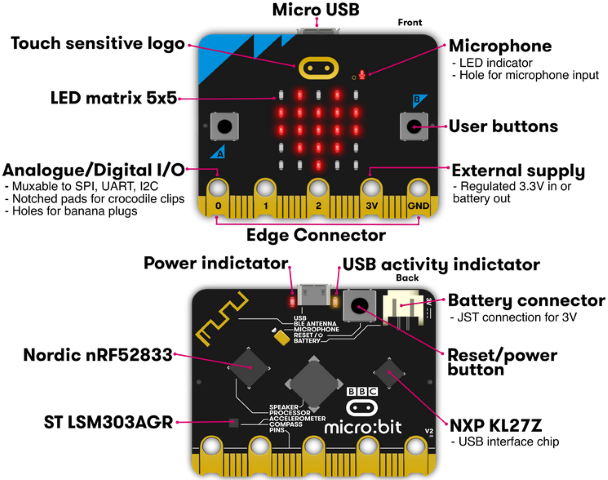

Micro:bit V2

Micro:bit V1.5

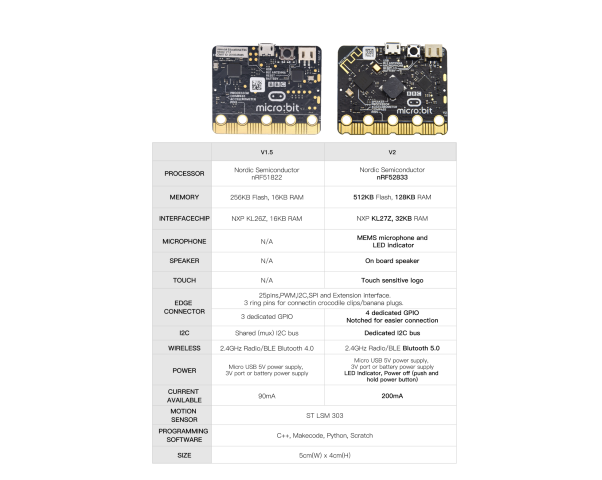

You can reboot micro:bit V2 when pressing reset and power button.

LED will get dark and the power-saving mode will be activated if you keep
pressing reset and power button, which can make the life expectancy of batteries
longer and activate micro:bit.

More resource：<https://tech.microbit.org/hardware/>

https://microbit.org/new-microbit/

https://www.microbit.org/get-started/user-guide/overview/

<https://microbit.org/get-started/user-guide/features-in-depth/>

**Micro:bit Pinout**

Micro:bit V2

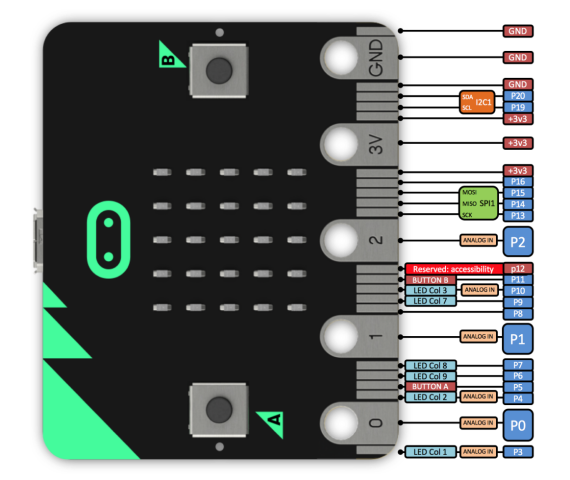

Micro:bit V1.5

Official website：<https://tech.microbit.org/hardware/edgeconnector/>

<https://microbit.org/guide/hardware/pins/>

Note:

1.  Put it on with silicone case to prevent the short circuit due to electronic
    components on micro:bit V2

b. Don’t interface V2 board with high current components(such as servo MG995, DC
motor) because of its weak driving ability (less than 300mA)of IO port,
otherwise, it will be burned out.

We recommend you to work with micro:bit expansion board before using it.

c. We supply power via USB port or 3V port of micro:bit V2. However, the
micro:bit shield is needed if you use 5V sensor because its voltage is 3V.

d. Remember to disable(you can use this block to disable the
pin )the common pins of micro:bit
like P3, P4, P6, P7 and P10 in the code, otherwise, the data will be wrong.

e. The battery above 3.3V is not allowed to be used, otherwise, micro:bit V2
will get damaged.

f. Don’t put it on the metal object to avoid short circuit.

To conclude, micro:bit V2 is like a mini computer.

Online coding website: <https://microbit.org/code/>

## Product Kit：

| \## | Name                              | QTY |  Picture                                                                                                                                                                                                                                                                                                                                                                                                                                                                                                                 |
|----|-----------------------------------|-----|--------------------------------------------------------------------------------------------------------------------------------------------------------------------------------------------------------------------------------------------------------------------------------------------------------------------------------------------------------------------------------------------------------------------------------------------------------------------------------------------------------------------------|
| 1  | Micro：bit Development Board      | 1   | 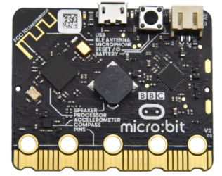                                                                                                                                                                                                                                                                                                                                                                                                                                                                          |
| 2  | Keyestudio T-type Expansion Board | 1   |                                                                                                                                                                                                                                                                                                                                                                                                                                                                     |
| 3  | USB Cable                         | 1   |                                                                                                                                                                                                                                                                                                                                                                                                                                                                |
| 4  | 2-slot AA Battery Holder          | 1   |                                                                                                                                                                                                                                                                                                                                                                                                                                                                |
| 5  | 400 Holes Breadboard              | 1   |                                                                                                                                                                                                                                                                                                                                                                                                                                                                |
| 6  | Breadboard Lead                   | 1   |                                                                                                                                                                                                                                                                                                                                                                                                                                                                    |
| 7  | 90°Keyestudio Servo               | 1   |                                                                                                                                                                                                                                                                                                                                                                                                                                                                |
| 8  | 1-digit Segment Display           | 1   |                                                                                                                                                                                                                                                                                                                                                                                                                                                                    |
| 9  | Passive Buzzer                    | 1   |                                                                                                                                                                                                                                                                                                                                                                                                                                                                    |
| 10 | Active Buzzer                     | 1   |                                                                                                                                                                                                                                                                                                                                                                                                                                                                    |
| 11 | Push Button Sensor                | 2   |                                                                                                                                                                                                                                                                                                                                                                                                                  |
| 13 | Adjustable Potentiometer          | 1   |                                                                                                                                                                                                                                                                                                                                                                                                                                                                    |
| 14 | Common Cathode Full Color RGB     | 1   |                                                                                                                                                                                                                                                                                                                                                                                                                                                                |
| 15 | LM35DZ Temperature Sensor         | 1   |                                                                                                                                                                                                                                                                                                                                                                                                                                                                    |
| 16 | 5MM Photoresistor                 | 3   |                                                                                                                                                                                                                                                                                                                                                      |
| 17 | Thermistor Sensor                 | 1   |                                                                                                                                                                                                                                                                                                                                                                                                                                                                |
| 18 | Flame Sensor                      | 1   |                                                                                                                                                                                                                                                                                                                                                                                                                                                                    |
| 19 | Ball Tilt Switch                  | 2   |                                                                                                                                                                                                                                                                                                                                                                                                             |
| 20 | F5 Red LED                        | 5   |                                                                                                                                                                                                                                                                                                                                                                                                                                                                |
| 21 | F5 Yellow LED                     | 5   |                                                                                                                                                                                                                                                                                                                                                                                                                                                                |
| 22 | F5 Blue LED                       | 5   |                                                                                                                                                                                                                                                                                                                                                                                                                                                                |
| 23 | F5 Green LED                      | 5   |                                                                                                                                                                                                                                                                                                                                                                                                                                                                |
| 24 | 220R Resistor                     | 10  |  |
| 25 | 1K Resistor                       | 10  |  |
| 26 | 10K Resistor                      | 10  |  |
| 27 | 4.5V 3-slot AA Battery Holder     | 1   |                                                                                                                                                                                                                                                                                                                                                                                                                                                               |

## Install the Driver of Micro:bit

The installation of driver wouldn't be needed, if you already installed it.

But, you need to install driver if it’s your first use.

Download link: https://fs.keyestudio.com/KS0306-Driver

You can download driver file ()
in the folder.

## Programming：

We will take Windows system as example.

#### 4.1 Quick Start：

This chapter introduces how to program and download code to micro:bit V2. There
are detailed tutorials in the official website, as shown below:

[https://microbit.org/guide/quick/](Https://microbit.org/guide/quick/)

###### Step 1: Connect Micro:bit V2

Interface micro:bit V2 with your computer using USB cable. （Guide to mobile &
tablet apps：<https://microbit.org/get-started/user-guide/mobile/>).

Macs , PCs, Chromebooks and Linux system（including Raspberry Pi）support
micro：bit V2.

After board is connected to computer, a red LED at the back of micro:bit V2 will
be on.

There will be a MICROBIT drive in your computer, as shown below:

###### Step 2: Programming：

Enter <https://makecode.microbit.org/> (we recommend you to use Google Chrome),
then click  and you will view a
dialog box.

Input“heartbeat”to name your project and click“Create”.

What’s more, you can download Makecode app if your system is Windows 10:
[https://www.microsoft.com/zh-cn/p/makecode-for-micro-bit/9pjc7sv48lcx?ocid=badgep&rtc=1&activetab=pivot:overviewtab](https://www.microsoft.com/zh-cn/p/makecode-for-micro-bit/9pjc7sv48lcx?ocid=badgep&rtc=1##activetab=pivot:overviewtab)

Through MakeCode editor, you just need to drag blocks from block area into code
editing area to program. Then run this code on simulator of makecode, as shown
below:

We provide a guidance video in the test code folder(download test code in the
link [https://fs.keyestudio.com/KS03](https://fs.keyestudio.com/KS0428)06

###### Step 3: Download Code：

The code can be directly downloaded to micro:bit V2 if you tap“Download”icon on
makecode App.

However, follow the steps below if you program via online makecode editor.

Enter online Makecode editor, tap“Download”to get a“hex”file. Then copy it into
MICROBIT drive.

Or you can find out“hex”file firstly and right-click to select“Send
to”MICROBIT（E）”.

Then hex file will be copied on MICROBIT drive.

The yellow indicator will flash when transferring“hex” into micro:bit V2. And it
is solid on after the file is copied.

###### Step 4: Run Program：

Download code to micro:bit V2 and connect micro:bit V2 to external power with
USB cable.

5 x 5 LED will show heartbeat pattern.

 Power Supply-----micro USB
 External Power（3V）

**Step5：Acknowledge：**

You can code in other ways:

<https://microbit.org/code/>

<https://microbit.org/projects/>

#### 4.2.Makecode：

Navigate <https://makecode.microbit.org/> on Google Chrome, and enter online
makecode editor. Or you can open makecode app for Windows 10.

Click“New Project”, input“heartbeat”, click“Create”and enter Makecode editor, as
shown below:

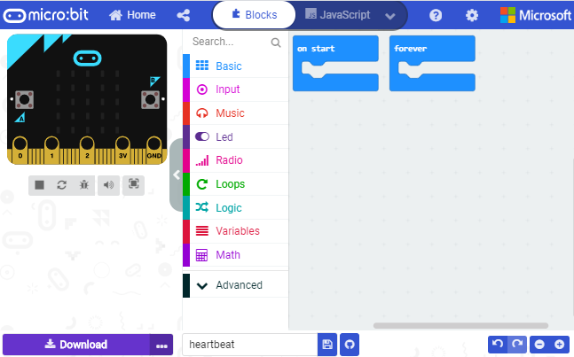

There are block“on start”and“forever”in the code editing area.

After power on or reset,“on start”block means that command blocks in the code
are only run once, however,“forever”implies that code runs cyclically.

#### 4.3. Quick Download：

You can click“download”to transfer code to micro:bit V2 if you use makecode App
for Windows 10.

Whereas, the online Makecode editor requires intricate steps.

Operating Google Chrome on Android, ChromeOS, Linux, macOS or Windows 10 system,
you can achieve the quick download.

We use the webUSB function of Chrome to allow the internet page to access the
hardware device connected USB.

You can refer to the following steps to connect and pair device.

Pairing Device:

Interface micro:bit V2 with computer using USB cable.

Click“...”beside“Download”and tap“Pair device”.

Continue to tap“Pair device”

Then select the device you want to connect and tap“connect”in the window .

If there is no device in the window, please refer to the following link:

[https://makecode.microbit.org/device/usb/webusb/troubleshoot](https://makecode.microbit.org/device/usb/webusb/troubleshoot%20)

We also provide in the resource
link.

What’s more, if you don’t know how to update the firmware of micro:bit, refer to
the link:
[https://microbit.org/guide/firmware/](https://microbit.org/guide/firmware/%20)
or browse folderwe provide.

After connecting successfully, press buttons and download code to micro:bit V2.

#### 4.4. Resource：

https://fs.keyestudio.com/KS0306

#### 4.5. Import Code：

We provide every program with a hex file. You can import it directly or program
in Makecode blocks area

Next, we will take“heartbeat”as example to introduce how to import code.

Open online Makecode editor or Makecode App.

Tap“import”and“Import File”

Choose file“../Makecode Code/Project 1\_ Heart beat/Project 1\_ Heart beat.hex”,
then tap“Go ahead”

In addition to the above method of importing code, you can also directly drag
code into the Makecode compiler, as shown in the figure below:

The program is imported successfully after a few seconds.

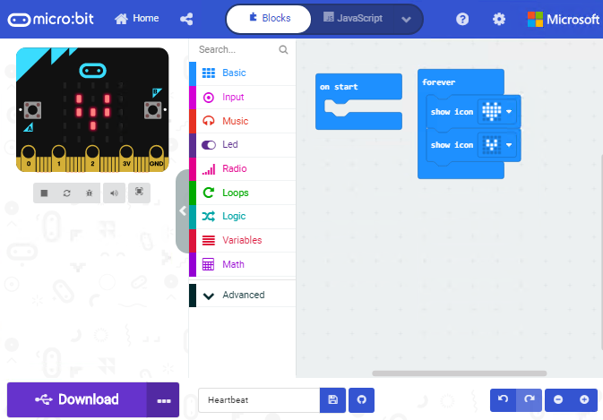

If your computer system is Windows7/8 instead of Windows 10, the device can’t be
paired in Google Chrome, as a result, the digital and analog signals can’t be
read.

Here, we need CoolTerm software to read data.

For the whole projects, we will use CoolTerm software.

Let’s install it firstly.

#### 4.6. Install CoolTerm：

CoolTerm program is used to read the serial communication.

Download CoolTerm program:

<https://freeware.the-meiers.org/>

1.  After the download, we need to install CoolTerm Win, and we take example of
    the Window system

2.  Choose“win”

3.  Unzip file and open it. (also suitable for Mac and Linux system)

1.  Double-click 

Note: Firstly, you have to install the driver of micro:bit and connect micro:bit
V2 to computer.

The functions of each button on the toolbar are listed below:
<http://wiki.keyestudio.com/index.php/File:IDE.png>

|         | Opens up a new Terminal                           |
|--------------------------------------------------------|---------------------------------------------------|
|         | Opens a saved Connection                          |
|         |  Saves the current Connection to disk             |
|  | Opens the Serial Connection                       |
|  | Closes the Serial Connection                      |
|  | Clears the Received Data                          |
|  | Opens the Connection Options Dialog               |
|  | Displays the Terminal Data in Hexadecimal Format  |
|         | Displays the Help Window                          |

## Projects：

#### Project 1: Heartbeat

1.  **Description:**

Prepare a Micro:bit V2, a USB cable and a computer. Next we will conduct a basic
experiment that a heartbeat pattern flashes on micro:bit board.

1.  **Components:**

-   Micro:bit V2 \*1

-   Micro USB Cable\*1

**3. Wiring Up:**

Interface micro:bit V2 with your computer using micro USB cable.

**4. Example Code**

<iframe style="position:absolute;top:0;left:0;width:100%;height:100%;" src="https://makecode.microbit.org/#pub:_g8j2HWTDVLqy" frameborder="0" sandbox="allow-popups allow-forms allow-scripts allow-same-origin"></iframe>

You can enter this website
[https://makecode.micro:bit.org/reference](https://makecode.microbit.org/reference)
to get more information even you’re a starter.

Edit your code in the link:
[https://makecode.micro:bit.org/](https://makecode.microbit.org/)

**5. Test Result**

Download code to micro:bit V2 (refer to chapter 4.1), and keep micro USB cable
connected. Then image“❤”and“”will
be shown on micro:bit ceaselessly.

If download unsuccessfully, disconnect micro:bit V2 and reboot it please.

Then download code to V2 board again

#### Project 2: Light Up A Single LED

1.  **Description:**

In this project, we will turn on an LED of micro:bit V2.

1.  **Components:**

-   Micro:bit V2 \*1

-   Micro USB Cable\*1

**3. Wiring Up:**

Interface micro:bit V2 with your computer using micro USB cable.

**4. Component Overview：**

Micro:bit V2 consists of 25 light-emitting diodes, 5 pcs in a group. They
correspond to x and y axis. Then the 5\*5 matrix is formed. Moreover, every
diode locates at the point of x and y axis.

Virtually, we can control an LED by setting coordinate points. For instance, set
coordinate point（0，0）to turn on the LED at row 1 and column 1; light up LED
at the row 1 and column 3, we can set（2，0) and so on.

**5.Example Code**

<iframe style="position:absolute;top:0;left:0;width:100%;height:100%;" src="https://makecode.microbit.org/#pub:_F5pLkiM1xeTb" frameborder="0" sandbox="allow-popups allow-forms allow-scripts allow-same-origin"></iframe>

1.  **Test Result**

Download code to micro:bit V2 and connect it to computer with USB cable. As a
result, the LED at coordinate point (1,0) flashes for 1 s and the LED at
(3,4）blinks for 1s, alternately.

#### Project 3: 5 x 5 LED Dot Matrix

1.  **Description:**

Dot matrix gains popularity in our life, such as LED screen, bus station and the
mini TV in the lift.

The dot matrix of Micro:bit board consists of 25 light emitting diodes. In
previous lesson, we control LED of Micro:bit board to form patterns, numbers and
character strings by setting the coordinate points. Moreover, we could adopt
another way to complete the display of patterns, numbers and character strings.

1.  **Components:**

-   Micro:bit V2 \*1

-   Micro USB Cable\*1

**3. Wiring Up:**

Interface micro:bit V2 with your computer using micro USB cable.

**4.Example Code**

<iframe style="position:absolute;top:0;left:0;width:100%;height:100%;" src="https://makecode.microbit.org/#pub:_UsqR36HdYdCa" frameborder="0" sandbox="allow-popups allow-forms allow-scripts allow-same-origin"></iframe>

**5. Test Result**

Download code to micro:bit V2, and and keep USB cable connected. Micro:bit V2
will display 1, 2, 3, 4 and 5 and separately show
 icon,

“Hello!”, ,
,
,
 and
patterns.

#### Project 4: Programmable Buttons

1.  **Description:**

The circuit is controlled by button. The circuit is connected when the button is
pressed; however, the circuit is disconnected when released.

Micro:bit V2 has three buttons which are the reset button on the back and two
programmable buttons(A, B) on the front. Next, let’s conduct experiment to know
how button works.

**2. Components:**

-   Micro:bit V2 \*1

-   Micro USB Cable\*1

**3. Wiring Up:**

Interface micro:bit V2 with your computer using micro USB cable.

**4. Example Code 1:**

<iframe style="position:absolute;top:0;left:0;width:100%;height:100%;" src="https://makecode.microbit.org/#pub:_gA8WV33AvbM9" frameborder="0" sandbox="allow-popups allow-forms allow-scripts allow-same-origin"></iframe>

1.  **Test Result 1:**

Download code to micro:bit V2 and keep USB cable connected.

5×5 LED dot matrix will show the corresponding letter if the button A or B is
pressed. In other words, the micro:bit V2 will also show“AB”if you press A and B
buttons simultaneously.

**6. Example Code 2:**

<iframe style="position:absolute;top:0;left:0;width:100%;height:100%;" src="https://makecode.microbit.org/#pub:_FX2Fj6FYkesp" frameborder="0" sandbox="allow-popups allow-forms allow-scripts allow-same-origin"></iframe>

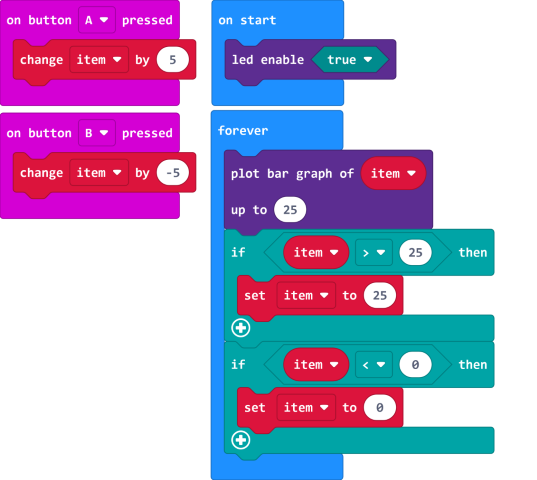

**7. Test Result 2:**

Download code to micro:bit V2 and keep USB cable connected. A row of luminous
LEDs are added if button A is pressed; and when B is pressed, a row of luminous
LEDs are deducted.

#### Project 5: Temperature Measurement

1.  **Description:**

We will introduce how to detect ambient temperature by micro:bit V2. Its
detection range is -40℃\~105℃.

**2. Components:**

-   Micro:bit V2 \*1

-   Micro USB Cable\*1

**3. Wiring Up:**

Interface micro:bit V2 with
your computer using micro USB cable.

**4.Example Code**

<iframe style="position:absolute;top:0;left:0;width:100%;height:100%;" src="https://makecode.microbit.org/#pub:_AArXw8M7WWuA" frameborder="0" sandbox="allow-popups allow-forms allow-scripts allow-same-origin"></iframe>

**5. Test Result**

Download code to micro:bit V2 and plug in power with USB cable. Then click“Show
console Device”button.

Open serial interface to check temperature value, as shown below：

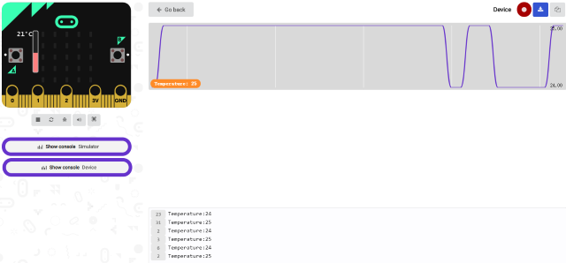

If your computer system is Windows7/8 instead of Windows 10, the device can’t be
paired in Google Chrome, as a result, the digital and analog signals can’t be
read.

Here, we need CoolTerm software to read data.

Open CoolTerm, click“Options”to select“SerialPort”. Set COM port and 115200 baud
rate(the baud rate of USB serial communication of micro:bit V2 is 115200 through
the test). And click“OK”and“Connect”.

The serial monitor shows the current ambient temperature value, as shown below:

#### Project 6: Micro:bit’s Compass

1.  **Description：**

This project mainly introduces the use of the Micro:bit’s compass. In addition
to detecting the strength of the magnetic field, it can also be used to
determine the direction, an important part of the heading and attitude reference
system (AHRS) as well.  
It uses LSM303AGR three-axis magnetometer whose the range of magnetic field is
±50 gauss. In this project, we will introduce how compass detect data and
determine direction.

Then we can read the value detected by it to determine the location. We need to
calibrate the micro:bit V2 when magnetic sensor works.

1.  **Components:**

-   Micro:bit V2 \*1

-   Micro USB Cable\*1

**3. Wiring Up:**

Interface micro:bit V2 with your computer using micro USB cable.

**4. Example Code1:**

<iframe style="position:absolute;top:0;left:0;width:100%;height:100%;" src="https://makecode.microbit.org/#pub:_Kp1CXgYgYTpk" frameborder="0" sandbox="allow-popups allow-forms allow-scripts allow-same-origin"></iframe>

**5. Test Result1：**

Download code to micro:bit V2 and keep USB connected.

As the button A is pressed, LED dot matrix indicates that“TILT TO FILL
SCREEN”then enter the calibration interface.

The calibration method: rotate the micro:bit V2 to make LED dot matrix display a
full square (25 LEDs are on), as shown in the following figure:

The calibration won’t be finished until you view the smile pattern
appear.

The serial monitor will show 0°, 90°, 180° and 270° when button A is pressed.

**6. Example Code2:**

<iframe style="position:absolute;top:0;left:0;width:100%;height:100%;" src="https://makecode.microbit.org/#pub:_C1UAihb186yj" frameborder="0" sandbox="allow-popups allow-forms allow-scripts allow-same-origin"></iframe>

This block implies that the value is read ceaselessly and the arrow direction is
North.

The micro:bit V2 shows the icon,
if the value is between 292.5 and 337.5. The value should be 293 and 338 because
decimal is not allowed to be filled in the code.

**Complete Example Code2：**

**Test Result2:**

Download code to micro:bit V2 and keep USB cable connected.

After the calibration(see the result1) and tilt micro:bit V2, then the direction
signs will be shown.

#### Project 7: Accelerometer

1.  **Description:**

The micro:bit V2 has a built-in LSM303AGR three-axis acceleration sensor
(accelerometer). Its I2C interface works on external communication, the range
can be set to 1g, 2g, 4g and 8g.

We usually detect the posture of accelerometer.

In this project, we will check the value detected by accelerometer.

1.  **Components:**

-   Micro:bit V2 \*1

-   Micro USB Cable\*1

**3. Wiring Up:**

Interface micro:bit V2 with your computer using micro USB cable.

1.  **Example Code1:**

<iframe style="position:absolute;top:0;left:0;width:100%;height:100%;" src="https://makecode.microbit.org/#pub:_gHrgeTLbcbC2" frameborder="0" sandbox="allow-popups allow-forms allow-scripts allow-same-origin"></iframe>

1.  **Test Result 1:**

Download code to micro:bit V2 and keep USB cable connected.

Micro:bit V2 will display“1”if shaken.

Place micro:bit V2 vertically(logo up), then the number 2 is displayed:

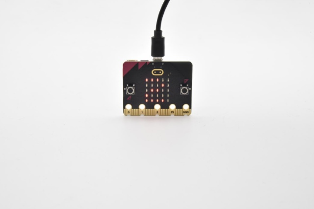

Place micro:bit V2 vertically(logo down), then the number 3 is displayed:

Place micro:bit V2 horizontally (facing up), then the number 4 is displayed:

On the contrary, place micro:bit V2 horizontally (facing down), then the number
5 is displayed:

When Micro:bit board is tilt to the left, number 6 is shown.

When Micro:bit board is inclined to the right, number 7 is displayed.

When it is free fall(accidentally making it fall), number 8 will appear on dot
matrix.（Note：we don’t recommend you to make it free fall, it will make board
damage)

**6. Example Code2：**

<iframe style="position:absolute;top:0;left:0;width:100%;height:100%;" src="https://makecode.microbit.org/#pub:_XsshE6RXFWTs" frameborder="0" sandbox="allow-popups allow-forms allow-scripts allow-same-origin"></iframe>

**7. Test Result2：**

Download code to micro:bit V2, keep USB cable connected, and click “Show Console
Device”

According to MMA8653FC manual, the acceleration coordinates of the accelerometer
are shown in the following figure:

The decomposition value of acceleration on the X-axis, Y-axis, and Z-axis, and
the synthesis value of acceleration (the synthesis of gravitational acceleration
and other external forces) are shown below:

If your computer system is Windows7/8 instead of Windows 10, the device won’t be
paired in Google Chrome.

Here, we need CoolTerm software to read data.

Open CoolTerm, click“Options”to select“SerialPort”.

Set“COM”port and 115200 baud rate(the baud rate of USB serial communication of
Micro:bit is 115200 through the test).

Click“OK”and“Connect”.

CoolTerm serial monitor displays the acceleration value on x, y and z axis, as
shown below:

#### Project 8: Detect Light Intensity by Micro:bit

1.  **Description:**

This project will introduce how micro:bit V2 detects the external light
intensity. Since micro:bit doesn’t come with photosensitive sensor, the
detection of light intensity is completed through the LED matrix. When the light
irradiates the LED matrix, the voltage change will be produced. Therefore, we
could determine the light intensity by voltage change.

1.  **Components:**

-   Micro:bit V2 \*1

-   Micro USB Cable\*1

**3. Wiring Up:**

Interface micro:bit V2 with your computer using micro USB cable

**4.Example Code**

<iframe style="position:absolute;top:0;left:0;width:100%;height:100%;" src="https://makecode.microbit.org/#pub:_C7ffmFTs8fov" frameborder="0" sandbox="allow-popups allow-forms allow-scripts allow-same-origin"></iframe>

1.  **Test Result**

Download code to micro:bit V2, keep USB cable connected, and click “Show Console
Device”

The intensity value is about 0 when covering LED dot matrix. And the value
varies with the light intensity. When placing micro:bit V2 under the sunlight,
the stronger the light is, and the larger the intensity value will be. As shown
below:

Number 20 in the code is a random light intensity value we set. Micro:bit V2
will show“moon”picture when the light intensity is less than or equivalent to
20; however, the “sun”image will appear if the value is more than 20.

If your computer system is Windows7/8 instead of Windows 10, the device can’t be
paired in Google Chrom.

Here, we need CoolTerm software to read data.

Open“CoolTerm”, click“Options”to select“SerialPort”, and set “COM” port and
115200 baud rate(the baud rate of USB serial communication of micro:bit V2 is
115200 through the test).

Then click“OK”and“Connect”.

The light intensity value is shown below:

#### Project 9: Speaker

1.  **Description：**

The micro:bit V2 has built-in speaker for emitting different tones. You can
composite a song like“Ode to Joy”and other beautiful songs.

1.  **Components:**

-   Micro:bit V2 \*1

-   Micro USB Cable\*1

1.  **Wiring Up:**

Interface micro:bit V2 with your computer using micro USB cable.

**4. Test Code1:**

<iframe style="position:absolute;top:0;left:0;width:100%;height:100%;" src="https://makecode.microbit.org/#pub:_MRHAqJ5HY5vJ" frameborder="0" sandbox="allow-popups allow-forms allow-scripts allow-same-origin"></iframe>

**5. Test Result 1:**

Download code to micro:bit V2 and plug in power with USB cable.

Then micro：bit V2 shows music icon and emits sound.

1.  **Test Code 2:**

<iframe style="position:absolute;top:0;left:0;width:100%;height:100%;" src="https://makecode.microbit.org/#pub:_7F8iE3PaodVm" frameborder="0" sandbox="allow-popups allow-forms allow-scripts allow-same-origin"></iframe>

**More resource**：

<https://en.wikipedia.org/wiki/Numbered_musical_notation>

1.  **Test Result 2:**

Download code to micro:bit V2 and plug in power with USB cable, as a result,
micro:bit V2 emits song“Ode to Joy”.

#### Project 10: Touch Sensitive Logo

1.  **Description：**

Micro:bit V2 has a touch sensitive logo as a input. It is fundamentally a
capacitive touch sensor which can sense the tiny changes in the current.

1.  **Components:**

-   Micro:bit V2 \*1

-   Micro USB Cable\*1

**3. Wiring Up:**

Connect micro:bit V2 to your computer with micro USB cable.

**4. Example Code**

<iframe style="position:absolute;top:0;left:0;width:100%;height:100%;" src="https://makecode.microbit.org/#pub:_ciW2zMXU8T5H" frameborder="0" sandbox="allow-popups allow-forms allow-scripts allow-same-origin"></iframe>

**5. Test Result**

Download code to micro:bit and connect it to power. Then if the logo of
micro:bit pressed, you will find“❤”appear on micro:bit; yet, if not pressed, the
number will be shown on micro:bit.

**6. Test Result:**

Download code to micro:bit V2 and keep USB cable connected.

Micro:bit V2 will show“❤”if you touch logo
, on the contrary, the number
will be shown if the log  is not
touched.

#### Project 11: Microphone

1.  **Description：**

The micro:bit V2 has a built-in microphone which can detect the sound intensity.

The microphone LED indicator in the front of micro:bit V2 will be turned on if
you clap your hands, therefore, we can make an analog noise level watch or
display a disco light effect.

**2. Components:**

-   Micro:bit V2 \*1

-   Micro USB Cable\*1

**3. Wiring Up:**

Interface micro:bit V2 with your computer using micro USB cable.

**4. Test Code1:**

<iframe style="position:absolute;top:0;left:0;width:100%;height:100%;" src="https://makecode.microbit.org/#pub:_1kE4MJVHwTMd" frameborder="0" sandbox="allow-popups allow-forms allow-scripts allow-same-origin"></iframe>

**5. Test Result1：**

Download code to micro:bit V2, and keep micro USB connected. Pattern“❤”will be
displayed when you clap your hands; however,
pattern“”will appear when in the
quit environment.

1.  **Example Code 2:**

<iframe style="position:absolute;top:0;left:0;width:100%;height:100%;" src="https://makecode.microbit.org/#pub:_HJu0q2L980h2" frameborder="0" sandbox="allow-popups allow-forms allow-scripts allow-same-origin"></iframe>

**7. Test Result 2：**

Download code to micro:bit V2 and keep micro USB cable connected. Click“Show
console device”.

The output sound value will increase when the sound amplifies, as shown below;

Micro:bit V2 will show the maximum value of sound intensity value(Note: set the
maximum value via reset button), when button A is pressed; whereas, the sound
level icon will be shown when clapping your hands.

#### Project 12: Read Bluetooth Data

1.  **Description：**

The micro:bit V2 comes with a
[nRF52833](https://www.nordicsemi.com/Products/Low-power-short-range-wireless/nRF52833)
processor, a low consumption BLE device(Bluetooth 5.1) and 2.4GHz ethernet
cable, communicating via Bluetooth wireless and 2.4GHz communication. In
addition, V2 board can communicate with other Bluetooth devices like smart
phones and computers.

In this experiment, we make micro:bit V2 play a role of Bluetooth wireless
communication by interfacing it with a device.

1.  **Preparation：**

1.  Interface micro:bit V2 with computer using USB cable.

2.  A cellphone or iPad

1.  **Steps**

(1) For iOS system.

Navigate website：<https://www.microbit.org/get-started/user-guide/ble-ios/>,
click“**Download pairing HEX file**”to download it in the folder or desktop of
your PC and transfer to micro:bit V2.

a. Open App Store

b. Search micro:bit and
click“”icon to download

c. Pair your device with micro:bit V2

d. Turn on the Bluetooth of your device

e. Make sure micro:bit is interfaced with your computer.

f. After the installation, click 
and select“Choose micro:bit”to pair Bluetooth.

g. Select“Choose micro:bit”and click “Pair a new micro:bit”.

h. Press and hold button A and B simultaneously, then press and release the
reset/power button. LED dot matrix will show a password image. At last, release
the button A and B at same time and click“Next”.

i. Next, design the password image on your device, and make password image as
same as micro:bit V2.

J. Click“Next”.

k. Then click“Next”and“Pair”. After a few seconds, micro:bit V2 will
show“√”pattern if the pairing is successful.

l. Then edit code on app and upload it

m. Tap“Create Code”to enter the programming page.

(Click, appear dialog
box，and select “Create √”）

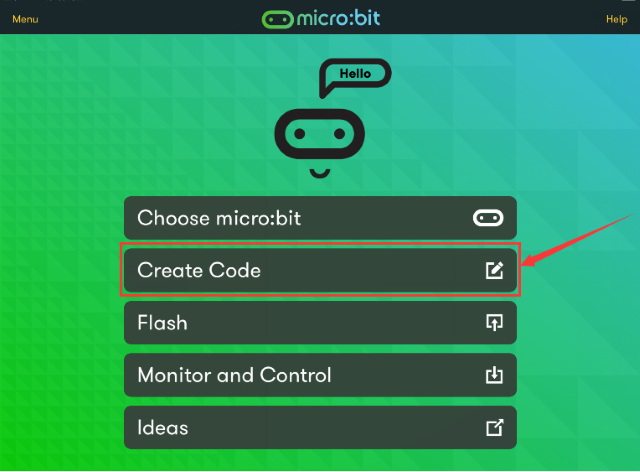

Name your program and click“” to
save it. We name“1”for this program.

After the code is saved, click“Flash”and select program 1.

Next, tap“Flash”to transfer program 1 to micro:bit V2.

Micro:bit V2 will show the“Heartbeat”pattern if flashing is successful.

#### Project: 13: Flashing LED

1.  **Description**

The experiment that flashes LED on and off is pretty simple and basic. In
general, we control LED via 5 x 5 LED dot matrix on micro:bit. In this chapter,
we will make LED blink.

**Parts Required**

-   Micro: bit\*1

-   micro bit T-type Shield \*1

-   USB Cable\*1

-   LED\*1

-   220Ω Resistor\*1

-   Breadboard\*1

-   Breadboard Wires

**Hooking Up**

**Test Code**

<iframe style="position:absolute;top:0;left:0;width:100%;height:100%;" src="https://makecode.microbit.org/#pub:_bwc2m2J7p8zj" frameborder="0" sandbox="allow-popups allow-forms allow-scripts allow-same-origin"></iframe>

**Test Result**

Download code, plug in power and LEDs attached to IO port blink ceaselessly,
with the interval of 0.5s

#### Project 14 Advertising Light

1.  **Description**

The advertising light is everywhere in our daily life. It shows different
information like words, slogans and images. Do you want to create your adverting
light? This experiment will simulates advertising light effect.

**Parts Required**

-   Micro: bit\*1

-   micro bit T-type Shield \*1

-   USB Cable\*1

-   LED\*5

-   220Ω Resistor\*5

-   Breadboard\*1

-   Breadboard Wires

**Hooking Up**

**Test Code**

**Test Result**

Download code, plug in power and LEDs connected to IO port gradually get bright
then dark one by one.

#### Project 15 Button-controlled LED

1.  **Description**

Micro:bit has three buttons, two of which are button A and B in the front and
one reset button. In this project, we will control LED on and off via button A
or B.

**Parts Required**

-   Micro：bit\*1

-   Micro:bit T-type Expansion Board \*1

-   USB Cable\*1

-   LED\*1

-   220Ω Resistor\*1

-   Breadboard\*1

-   Breadboard Wires

**Hooking Up**

**Test Code**

<iframe style="position:absolute;top:0;left:0;width:100%;height:100%;" src="https://makecode.microbit.org/#pub:_Kxid2vArCKM9" frameborder="0" sandbox="allow-popups allow-forms allow-scripts allow-same-origin"></iframe>

**Test Result**

Download code and plug in power firstly.

LED will be on if button A on micro:bit is pressed, otherwise, it will be off.

#### Project 16 Responder

**1. Description**

In the previous experiment, LED is controlled by buttons of micro:bit. In this
lesson, we will teach you how to make a responder. Simultaneously, the two push
buttons and a button of micro:bit are used to control the two LEDs

**Parts Required**

-   Micro:bit \*1

-   micro bit T-type Shield \*1

-   USB Cable\*1

-   LED\*2

-   Push Button\*2

-   220Ω Resistor\*2

-   10KΩ Resistor\*2

-   Breadboard\*1

-   Breadboard Wires

**Hooking Up**

**Test Code**

**Test Result**

Download code and plug in power firstly. The color of LED decides who the winner
is.

And the two LEDs will be off when button A is pressed.

#### Project 17 Breathing LED

1.  **Description**

We’ve known how to control LED on and off. Now, in this chapter, we will make
LED effect simulate human breath.

**Parts Required**

-   Micro：bit\*1

-   Micro:bit T-type Expansion Board \*1

-   USB Cable\*1

-   LED\*1

-   220Ω Resistor\*1

-   Breadboard\*1

-   Breadboard Wires

**Hooking Up**

**Test Code**

**External LED**

**Test Result**

Download code, plug in power and LED's brightness smoothly changes from dark to
bright and back to dark, continuing to do so and giving the illusion of an
LED“breathing.”

#### Project 18 Adjust Light Brightness

1.  **Description**

In this project, we will adjust LED brightness via potentiometer.

Remember to connect the ports of LED and potentiometer to analog ports.

**Parts Required**

-   Micro：bit Board\*1

-   Micro bit T-type Expansion Board \*1

-   USB Cable\*1

-   LED\*1

-   220Ω Resistor\*1

-   Adjustable Potentiometer\*1

-   Breadboard\*1

-   Breadboard Wires

**Hooking Up**

**Test Code**

**Test Result**

Transfer code to micro:bit, plug in power and adjust the LED brightness by
rotating adjustable potentiometer.

#### Project 19 RGB Light

1.  **Description**

The RGB color mode is a color standard in the industry. It obtains various
colors by changing the three color channels of red (R), green (G), and blue (B)
and integrating them. RGB denotes the three colors of red, green and blue.

In this experiment, we adjust the mixture of red, green and blue to get the
full-color effect by controlling the voltage of pin R, G and B

**Parts Required**

-   Micro：bit \*1

-   Micro:bit T-type Expansion Board \*1

-   USB Cable\*1

-   Common Cathode F5-Full Color RGB\*1

-   Breadboard\*1

-   Breadboard Wires

**Hooking Up**

**Test Code**

**Test Result**

Hook up according to connection diagram, upload code and plug in power.

RGB will show red, green, blue, yellow, purple and white.

#### Project 20 Sensitive Light

1.  **Description**

The photoresistor can change the resistance due to the light intensity.

In this experiment, we can control the LED brightness via a photoresistor.

**Parts Required**

-   Micro：bit\*1

-   Micro:bit T-type Expansion Board \*1

-   USB Cable\*1

-   LED\*1

-   220Ω Resistor\*1

-   5MM Photoresistor\*1

-   10KΩ Resistor\*1

-   Breadboard\*1

Breadboard Wires

**Hooking Up**

**Test Code**

**Test Result**

Upload code and plug in power firstly. The darker the LED will be, the brighter
the ambient light sensed by photoresistor is, on the contrary, the LED
brightness will be brighter if the ambient light intensity gets darker.

#### Project 21 Active Buzzer

1.  **Description**

Active buzzer is widely used as a sound making element on computer, printer,
alarm, electronic toy, telephone, timer and more. It has an inner vibration
source. Simply connect it with 5V power supply, it can buzz continuously. In the
experiment, we input a high level signal to make buzzer emit sound.

**Parts Required**

-   Micro：bit \*1

-   Micro:bit T-type Expansion Board \*1

-   USB Cable\*1

-   Active Buzzer\*1

-   Breadboard\*1

-   Breadboard Wires

**Hooking Up**

**Test Code**

**Test Result**

Upload code, plug in power firstly. Then buzzer will emit sounds with the
interval of 0.5s

#### Project 22 Passive Buzzer

1.  **Description**

Normally, the experiment is done with a buzzer.The buzzer we introduced here is
a passive buzzer. It cannot be actuated by itself, but by external pulse
frequencies. Different frequency produces different sound.

**Parts Required**

-   Micro：bit\*1

-   Micro:bit T-type Expansion Board \*1

-   USB Cable\*1

-   Passive Buzzer\*1

-   Breadboard\*1

-   Breadboard Wires

**Hooking Up**

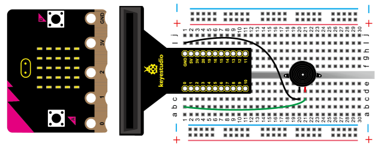

**Test Code**

**Test Result**

Upload code and plug in power firstly. Then we will hear the song“Ode to Joy”

#### Project 23 Servo Control

**1. Description**

Servo motor is a position control rotary actuator.

It mainly consists of housing, circuit board, core-less motor, gear and position
sensor.

Servo motor comes with many specifications. But all of them have three
connection wires, distinguished by brown, red, orange colors (different brand
may have different color). Brown one is for GND, red one for power positive,
orange one for signal line.

In the experiment, we adjust the rotation angle of a servo via a potentiometer.

**Parts Required**

-   Micro：bit\*1

-   Micro:bit T-type Expansion Board \*1

-   USB Cable\*1

-   9G Servo\*1

-   Adjustable Potentiometer\*1

-   Breadboard\*1

-   Breadboard Wires

Note：

1.  The 3-slot AA battery holder is required for power supply due to the large
    current of driving servo. (battery is not included in the kit)

You only need to interface the Ground port of battery pack to GND of micro:bit

1.  In the test, the micro:bit is supposed to be supplied power with micro USB
    cable rather than 2-slot AA battery holder.

**Hooking Up**

**Test Code**

**Test Result**

Upload code and plug in power firstly. Then The rotation angle of servo can be
controlled by adjustable potentiometer.

#### Project 24 Fire Flame

1.  **Description**

As it fairly sensitive to flame, flame sensor (IR receiving triode) is generally
applied to search for fire sources. It utilizes specific infrared receive tube
to detect flame, and then converts the brightness into changed level signal.

Therefore, when detecting the fire nearby, it will alarm to remind people to put
out the fire in time.

**Parts Required**

-   Micro：bit\*1

-   Micro:bit T-type Expansion Board \*1

-   USB Cable\*1

-   Flame Sensor\*1

-   Active Buzzer\*1

-   10KΩ Resistor\*1

-   Breadboard\*1

-   Breadboard Wires

**Hooking Up**

Sensor connection:

**Test Code**

**Test Result**

Upload code and plug in power firstly. The active buzzer will alarm when there
is fire nearby the flame sensor; otherwise, it won’t emit sounds.

#### Project 25: 1-digit LED Segment Display

1.  **Description**

LED segment display is a semiconductor light-emitting device. Its basic unit is
a light-emitting diode (LED).

LED segment display can be divided into 7-segment display and 8-segment display
according to the number of segments. 8-segment display has one more LED unit (
for decimal point display) than 7-segment one.

According to the wiring method of LED units, LED segment display can be divided
into common anode display and common cathode display. Common anode display
refers to the one that combine all the anodes of LED units into one common anode
(COM).

In this experiment, we use a 8-segment display module. A, b, c, d, e, f, g and h
are separately connected to p13, p14, p8, p9, p10, p12, p11 and p7.

For the common anode display, connect the common anode (COM) to +5V. When the
cathode level of a certain segment is low, the segment is on; when the cathode
level of a certain segment is high, the segment is off.

**Parts Required**

-   Micro：bit \*1

-   Micro:bit T-type Expansion Board \*1

-   USB Cable\*1

-   1-didit 7-segment Display Module\*1

-   Breadboard\*1

-   Breadboard Wires

**Hooking Up**

**Test Code**

**Test Result**

Upload code and plug in power firstly.

The 1-digit display module shows number from 0 to 9.

#### Project 26 Ball Tilt Switch

1.  **Description**

The purpose of tilt switch is to control the on circuit and off.

The switch is connected when it is inclined to one side, however, when inclined
to the other side, switch is off.

**Parts Required**

-   Micro：bit\*1

-   Micro:bit T-type

-   Expansion Board \*1

-   USB Cable\*1

-   Ball Tilt Switch\*2

-   LED\*2

-   220Ω 电阻\*2

-   10KΩ Resistor\*2

-   Breadboard\*1

-   Breadboard Wires

**Hooking Up**

**Test Code**

**Test Result**

Wire up, upload code and plug in power firstly. When you tilt the two tilt
switches to one side, one LED gets dark and the other gets bright; then one LED
is off and the other is on.

#### Project 27: Read Analog Value

1.  **Description**

There are plenty of digital ports and analog pins. In fact, micro:bit also has
analog ports to read analog value. As shown below:

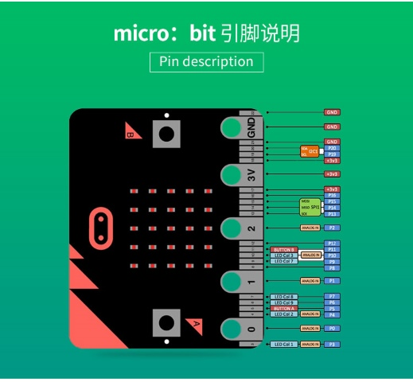

In this project, we change the analog value of P2 by rotating potentiometer and
display value on monitor----CoolTerm.

**Parts Required**

-   Micro：bit\*1

-   Micro:bit T-type Expansion Board \*1

-   USB Cable\*1

-   Adjustable Potentiometer\*1

-   Breadboard\*1

-   Breadboard Wires

**Hooking Up**

**Test Code**

**Test Result**

Wire up, upload code and plug in power.

Open“CoolTerm”, click“Options”to select“SerialPort”. Set COM port and 115200
baud rate(the baud rate of USB serial communication of micro:bit V2 is 115200
through the test). And click“OK”and“Connect”.

The monitor shows the value. However, the value varies between 0 and 1023, by
the adjustment of potentiometer.

#### Project 28 : Thermistor Sensor

1.  **Description**

The thermistor sensor can vary with the change of ambient temperature. In the
experiment, after the circuit is built, the temperature change is converted into
voltage change. The analog value will be shown on the monitor.

**Parts Required**

-   Micro：bit\*1

-   Micro:bit T-type Expansion Board \*1

-   USB Cable\*1

-   5MM Thermistor Sensor\*1

-   10KΩ Resistor\*1

-   Breadboard\*1

-   Breadboard Wires

**Hooking Up**

**Test Code**

**Test Result**

Connect the components, upload code and plug in power with USB cable.

Open“CoolTerm”, click“Options”to select“SerialPort”. Set COM port and 115200
baud rate(the baud rate of USB serial communication of micro:bit V2 is 115200
through the test). And click“OK”and“Connect”.

The monitor will show the corresponding value. The analog value will increase
when the temperature rises, as shown below；

#### Project 29 LM35 Temperature Sensor

1.  **Description**

LM35 is a common and easy-to-use temperature sensor. It does not require other
hardware. You just need an analog port to make it work. The difficulty lies in
compiling the code to convert the analog value it reads into Celsius
temperature.

LM35 temperature sensor can produce different voltage by different temperature.

When temperature is 0 ℃, it outputs 0V; if increasing 1 ℃, the output voltage
will increase 10 mv. In the experiment, the temperature value will be displayed
on monitor.

Note: Don’t reversely connect to LM35 temperature sensor, otherwise, it will be
burned out.

**Connection Pin**

**Parts Required**

-   Micro：bit\*1

-   Micro:bit T-type Expansion Board \*1

-   USB Cable\*1

-   LM35DZ\*1

-   Breadboard\*1

-   Breadboard Wires

**Hooking Up**

**Test Code**

**Test Result**

Wire up, upload code and plug in power firstly.

Open“CoolTerm”, click“Options”to select“SerialPort”. Set COM port and 115200
baud rate(the baud rate of USB serial communication of micro:bit V2 is 115200
through the test). And click“OK”and“Connect”.

The serial monitor shows the current ambient temperature value, as shown below:

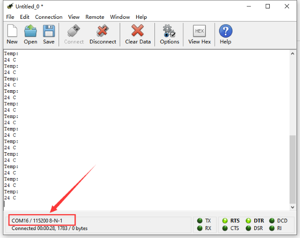

## Resource：

[https://fs.keyestudio.com/KS03](https://fs.keyestudio.com/KS0428)06

<https://makecode.microbit.org/>

<https://tech.microbit.org/hardware/>

<https://microbit.org/new-microbit/>

<https://www.microbit.org/get-started/user-guide/overview/>

<https://microbit.org/get-started/user-guide/features-in-depth/>

<https://tech.microbit.org/hardware/edgeconnector/>

<https://microbit.org/guide/hardware/pins/>

[https://microbit.org/guide/quick/](Https://microbit.org/guide/quick/)

<https://microbit.org/get-started/user-guide/mobile/>

<https://microbit.org/code/>

<https://microbit.org/projects/>

## 
